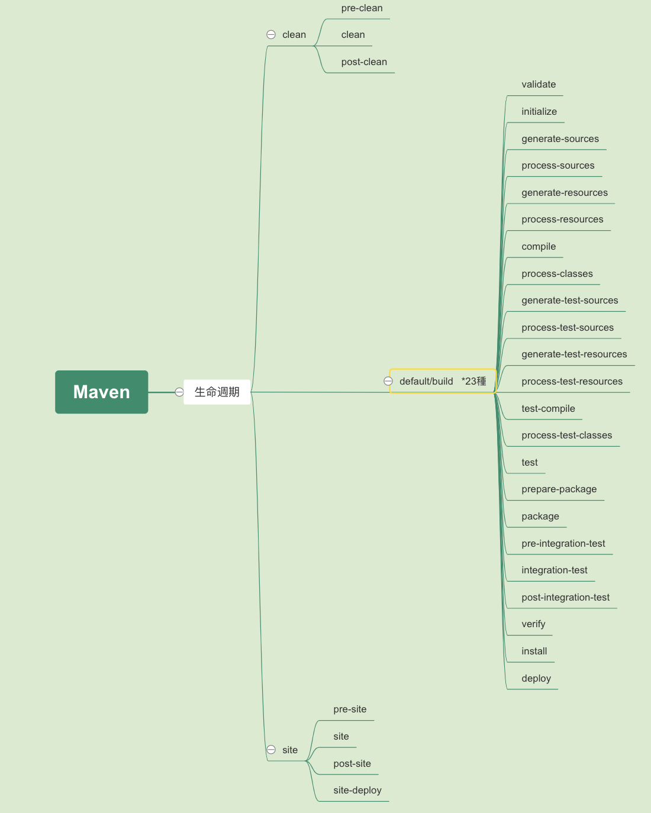

# Maven生命週期

Maven的生命週期定義一個項目建構與發佈的過程. Maven有三個標準的生命週期：

- **clean**，清除建置項目
- **default/build**，建置項目的建構與部署
- **site**，建置項目文件的產出



一個插件目標代表一個特定的任務（比構置階段更為精細），這些目標可能被綁定0 ~ n個階段。零綁定的目標可以在生命週期之外通過直接呼叫執行。這些目標的執行順序取決於呼叫的目標和執行建置階段的順序。

例如，考慮下面的命令：

```bash
$ mvn clean dependency:copy-dependencies package
```

`clean` 和 `pakage` 是建置階段，`dependency:copy-dependencies` 是目標。clean階段先執行，接下來dependency:copy-dependencies目標被執行，最後才輪到package階段。

## Clean生命週期

| 週期階段   | 說明                                  |
| ---------- | ------------------------------------- |
| pre-clean  | 執行一些需要在clean之前完成的工作     |
| clean      | 移除所有上次構置建生成的文件          |
| post-clean | 執行一些需要在clean之後立刻完成的工作 |

一個生命週期中，在其運行至某個階段的時候，它之前的所有階段都會被運行。

## Build(Default)生命週期

| 週期階段                                    | 說明                                                         |
| :------------------------------------------ | :----------------------------------------------------------- |
| validate（驗證）                            | 驗證項目是否正確並且所有必要的信息可以完成項目的建置過程。   |
| initialize（初始化）                        | 初始化建置狀態，比如設置屬性值。                             |
| generate-sources（生成原始碼）              | 生成包含在編譯階段中的任何原始碼。                           |
| process-sources（處理原始碼）               | 處理原始碼，比如說，過濾任意值。                             |
| generate-resources（生成資源文件）          | 生成將會包含在項目包中的資源文件。                           |
| process-resources （處理資源文件）          | 複製和處理資源到目標目錄，為打包階段最好準備。               |
| compile（編譯）                             | 編譯項目的原始碼。                                           |
| process-classes（處理類文件）               | 處理編譯生成的文件，比如說對Java class文件做字節碼改善優化。 |
| generate-test-sources（生成測試原始碼）     | 生成包含在編譯階段中的任何測試原始碼。                       |
| process-test-sources（處理測試原始碼）      | 處理測試原始碼，比如說，過濾任意值。                         |
| generate-test-resources（生成測試資源文件） | 為測試生成資源文件。                                         |
| process-test-resources（處理測試資源文件）  | 複製和處理測試資源到目標目錄。                               |
| test-compile（編譯測試原始碼）              | 編譯測試原始碼到測試目標目錄.                                |
| process-test-classes（處理測試類文件）      | 處理測試原始碼編譯生成的文件。                               |
| test（測試）                                | 使用合適的單元測試框架運行測試（Juint是其中之一）。          |
| prepare-package（準備打包）                 | 在實際打包之前，執行任何的必要的操作為打包做準備。           |
| package（打包）                             | 將編譯後的代碼打包成可發佈格式的文件，比如JAR、WAR或者EAR文件。 |
| pre-integration-test（整合測試前）          | 在執行整合測試前進行必要的動作。比如說，創建需要的環境。     |
| integration-test（整合測試）                | 處理和部署項目到可以運行整合測試環境中。                     |
| post-integration-test（整合測試後）         | 在執行整合測試完成後進行必要的動作。比如說，清理整合測試環境。 |
| verify （驗證）                             | 運行任意的檢查來驗證項目有效且達到標準。                     |
| install（安裝）                             | 安裝項目包到本地倉儲，這樣jar檔可以用作其他本地項目的依賴。  |
| deploy（部署）                              | 將最終的jar檔/war檔複製到遠端倉儲中與其他開發者和項目共享。  |

## Site生命週期

Maven Site 插件一般用來創建新的報告文檔、部署站點等。

| 週期階段    | 說明                                                       |
| ----------- | ---------------------------------------------------------- |
| pre-site    | 執行一些需要在生成站點文檔之前完成的工作                   |
| site        | 生成項目的站點文檔                                         |
| post-site   | 執行一些需要在生成站點文檔之後完成的工作，並且為部署做準備 |
| site-deploy | 將生成的站點文檔部署到特定的服務器上                       |

